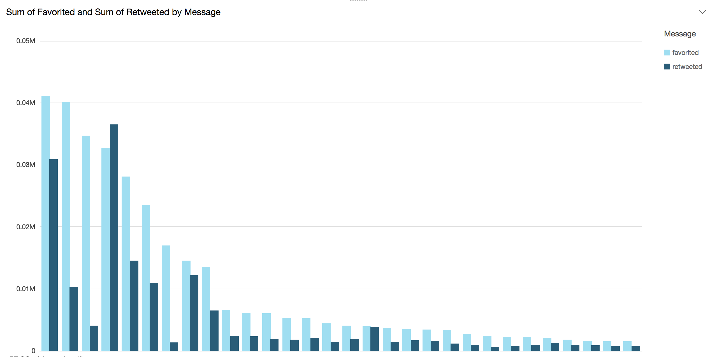

# λ# Query and Visualize CloudWatch Logs w/ Lambda and Athena

Collecting, parsing and analyzing machine data is very common these days. 
Applications like Sumologic, Splunk or Loggly help tens of thousands of organizations make sense of data (often in unpredictable formats), 
and gain business and operational insights that can help diagnose problems across services, detect security threats and much more.

This challenge is all about creating 100% serverless log parser using CloudWatch Logs, Lambda, and Athena. 

We are providing you with a log generator that uses the Twitter Streaming API to create logs on your behalf; you are responsible for parsing the data so that it can be queried using Athena.    


### Pre-requisites
The following tools and accounts are required to complete these instructions.

* [Install .NET Core 1.0.x](https://github.com/dotnet/core/blob/master/release-notes/download-archives/1.0.5-download.md)
* [Install AWS CLI](https://aws.amazon.com/cli/)
* [Sign-up for an AWS account](https://aws.amazon.com/)
* [Create a Twitter account](https://twitter.com/)

## LEVEL 0 - Setup
The following steps walk you through the set-up of a CloudWatch Log and the provided lambda function that will be used to parse the log stream.

---

### Please use the following credentials
In the LogGenerator directory, paste the following credentials in the `credentials.json`.

#### Team 1 
```json 
{
    "consumer_key" : "",
    "consumer_secret" : "",
    "access_token" : "",
    "access_secret" : ""
}
```
---

>**NOTE**:
> Only one twitter stream is allowed per set of credentials.

### If you want to create your own twitter credentials 
#### Create Twitter account:
1. Sign into Twitter and navigate to [https://apps.twitter.com/](https://apps.twitter.com/)
2. Click on [Create New App](https://apps.twitter.com/app/new)
3. Fill in the name, description, and a placeholder URL and create the twitter application
4. Navigate to `Keys and Access Tokens` tab and click `Create my access token`
5. Save the 
    1. Consumer Key
    2. Consumer Secret
    3. Access Token
    4. Access Token Secret
6. Navigate to `/LogGenerator/credentials.json` and complete the fields


### Create a `lambdasharp` AWS Profile
The project uses by default the `lambdasharp` profile. Follow these steps to setup a new profile if need be.

1. Create a `lambdasharp` profile: `aws configure --profile lambdasharp`
2. Configure the profile with the AWS credentials and region you want to use

### Create a CloudWatch Log Group and Log Stream
Set up the CloudWatch Log Group `/lambda-sharp/log-parser/dev` and a log stream `test-log-stream` via the [AWS Console](https://console.aws.amazon.com/cloudwatch) or by executing AWS CLI commands.
```shell
aws logs create-log-group --log-group-name '/lambda-sharp/log-parser/dev' --profile lambdasharp
aws logs create-log-stream --log-group-name '/lambda-sharp/log-parser/dev' --log-stream-name test-log-stream --profile lambdasharp
```

### Create `LambdaSharpLogParserRole` role for the lambda function
The `LambdaSharpLogParserRole` lambda function requires an IAM role. You can create the `LambdaSharpLogParserRole` role via the [AWS Console](https://console.aws.amazon.com/iam/home) or by executing [AWS CLI](https://aws.amazon.com/cli/) commands.
```shell
aws iam create-role --role-name LambdaSharp-LogParserRole --assume-role-policy-document file://assets/lambda-role-policy.json --profile lambdasharp
aws iam attach-role-policy --role-name LambdaSharp-LogParserRole --policy-arn arn:aws:iam::aws:policy/AWSLambdaFullAccess --profile lambdasharp
```

### Create the S3 logs bucket
```shell
aws s3api create-bucket --bucket "<USERNAME>-lambda-sharp-s3-logs" --create-bucket-configuration LocationConstraint=<AWS_REGION> --profile lambdasharp
```

### Deploy the `LogParser` lambda function
1. Navigate into the LogGenerator folder: `cd LogParser`
2. Run: `dotnet restore`
3. Edit `aws-lambda-tools-defaults.json` and make sure everything is set up correctly.
5. Run: `dotnet lambda deploy-function`

### Set up lambda trigger
1. From the AWS Console, navigate to the Lambda Services console
2. Find the deployed function and click into it to find the `Triggers` tab
3. Add a trigger and select `CloudWatch Logs` as the trigger
4. Select the log group `/lambda-sharp/log-parser/dev` and add a filter name

## Level 1 - Stream data from Twitter into CloudWatch
Using the included LogGenerator application, stream tweets directly into CloudWatch

### Stream Tweets into the CloudWatch Log
The included LogGenerator application can stream live tweets directly into the CloudWatch log matching the above setup.

>**NOTE**:
> The log group and stream names that the generator uses can be modified by changing the values in the `LogGenerator/application_vars.json` file.


1. Navigate into the LogGenerator folder: `cd LogGenerator`
2. Run: `./lambdasharp generate logs <filter>`  
 - `filter` is a keyword that will be used to stream related tweets e.g. `cats`, `dogs`, `running`, `music`, etc
 - This will stream log entries continuously to your cloudwatch log
 - Use `ctrl-C` to stop the stream
3. OR Run: `./lambdasharp generate sample <number> <filter>` 
 - `number` is the number of tweets you want to stream to cloudwatch logs

Data will begin streaming from Twitter into the CloudWatch log.
> Note: CloudWatch log events must be sent to a log stream in chronological order. You will run into issues if multiple instances of the LogGenerator are streaming to the same log stream at the same time.

## Level 2 - Decode and decompress CloudWatch Logs data

The data is base64 encoded and compressed, you must implement the `DecompressLogData` method and return the JSON containing the log records.
See the [documentation](http://docs.aws.amazon.com/AmazonCloudWatch/latest/logs/SubscriptionFilters.html#LambdaFunctionExample) for more information.

## Level 3 - Frame and filter log records
Each log entry contains several sections separated by a special character (you must find out what this character is). Each section contains useful information about the tweet and the user, 
such as user name total number of tweets, the number of re-tweets, date created and more. Filter this information and turn it into a JSON object. 

Repeat these steps for each entry in your logs.
 
>**NOTE**:
> Not all tweets have the same sections, for example, not all tweets have location information. You must account for missing data!


## Level 3 - Save data to S3
Put each JSON object in a file in S3. Each JSON object must be a single line, and each file can contain one or more lines.

This is important because Athena will count each line as a new record.

>*BONUS 1*: 
> Find out a "serverless" way to accumulate records across different executions of the lambda function and save them to S3 as a single file!


>*BONUS 2*: 
> Compress the file before putting it into S3. (Bonus 1 and 2 are not mutually exclusive)

### Level 4 - Set up Athena
Set up an Athena database called `lambdasharp_logs`, and create a table that defines the schema of the parsed JSON. The following is a minimal example, add additional fields for information found in the log streams.

```sql
CREATE DATABASE lambdasharp_logs;
```


```sql
CREATE EXTERNAL TABLE IF NOT EXISTS lambdasharp_logs.users (
  `user_name` string,
  `friends` int,
  `date_created` timestamp
)
ROW FORMAT SERDE 'org.openx.data.jsonserde.JsonSerDe'
WITH SERDEPROPERTIES (
  'serialization.format' = '1'
) LOCATION 's3://<USERNAME>-lambda-sharp-s3-logs/users/'
TBLPROPERTIES ('has_encrypted_data'='false');
```


## Boss Level - Visualize data using AWS QuickSight
You can use Amazon QuickSight to create visualizations of many data sources including Athena. 

>**NOTE**:
> to use QuickSight you will be required to do a 1 click sign up. It is free for 60 days and $9 after that.

### Give QuickSight Permissions to your S3 bucket
See [docs](http://docs.aws.amazon.com/quicksight/latest/user/managing-permissions.html) for more information.

### Connect to Athena
1. Make sure you are in the same region as the rest of your project
1. Click on `Connect to another data source...`
1. Select Athena and give your data source a name. Click on create
1. Select the Athena database `lambdasharp_logs`
1. Select the table you want to visualize, e.g. users or tweet_info
1. Select `Direct query your data` and create 

### Create visualizations
You are now ready to create different visualizations based on the data you have in Athena.



Happy Hacking!


## Acknowledgements
* Erik Birkfeld for organizing.
* [MindTouch](https://mindtouch.com/) for hosting.

## Copyright & License
* Copyright (c) 2017 Juan Manuel Torres, Katherine Marino, Daniel Lee
* MIT License
